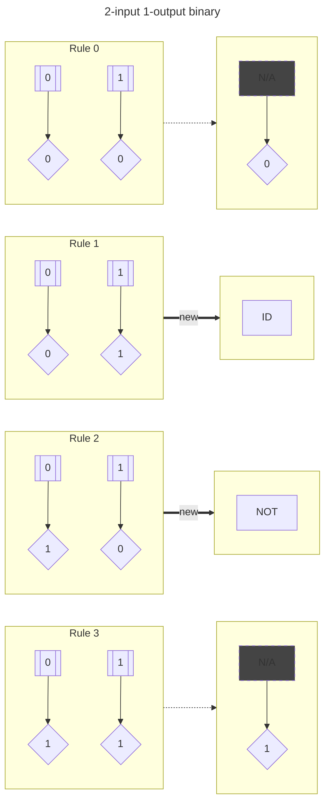

```mermaid
---
title: 2-input 1-output binary
---
flowchart LR
    subgraph Rule3 [Rule 3]
		30[[0]] --> 31{1}
		32[[1]] --> 33{1}
	end
    subgraph 3 [ ]
        120[N/A] --> 121{1}
        style 120 fill:#444,stroke-dasharray: 5 5
	end
    Rule3 -.-> 3


	subgraph Rule2 [Rule 2]
		20[[0]] --> 21{1}
		22[[1]] --> 23{0}
	end
    subgraph 2 [ ]
		110[NOT]
	end
    Rule2 == new ==> 2

	subgraph Rule1 [Rule 1]
		10[[0]] --> 11{0}
		12[[1]] --> 13{1}
	end
    subgraph 1 [ ]
		100[ID]
	end
    Rule1 == new ==> 1

	subgraph Rule0 [Rule 0]
		00[[0]] --> 01{0}
		02[[1]] --> 03{0}
	end
    subgraph 0 [ ]
		90[N/A] --> 91{0}
        style 90 fill:#444,stroke-dasharray: 5 5
	end
    Rule0 -.-> 0
```

