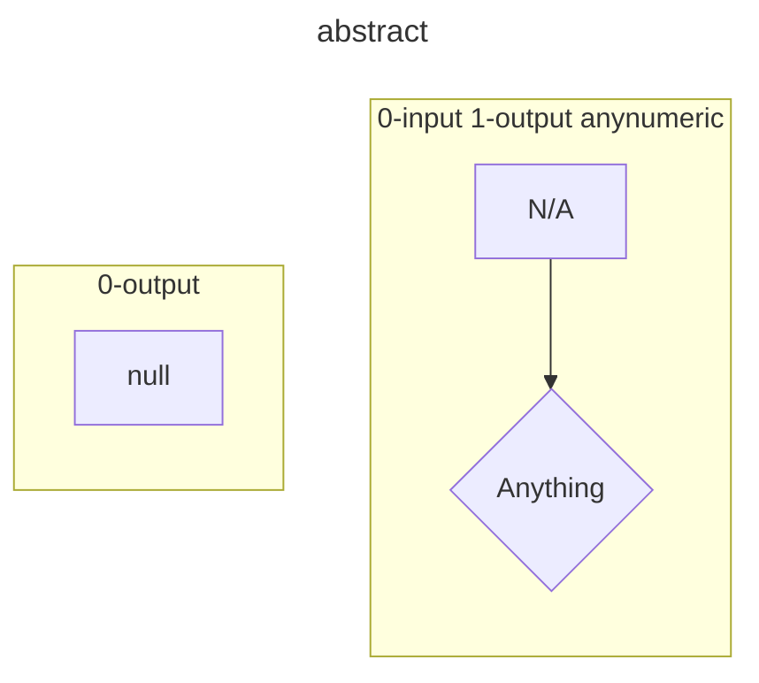

```mermaid
---
title: abstract
---
flowchart LR
    subgraph nany [0-input 1-output anynumeric]
        na[N/A] --> any{Anything}
    end
    subgraph 0 [0-output]
        null[null]
    end
    0 ~~~ nany
```

```mermaid
---
title: 0-input 1-output binary
---
flowchart LR
	subgraph Rule1 [Rule 1]
		10[[N/A]] --> 11{1}
        style 10 fill:#444,stroke-dasharray: 5 5
	end

	subgraph Rule0 [Rule 0]
		00[[N/A]] --> 01{0}
        style 00 fill:#444,stroke-dasharray: 5 5
	end
    Rule0 ~~~ Rule1
```

```mermaid
---
title: 1-input 1-output binary
---
flowchart LR
    subgraph Rule3 [Rule 3]
		r3i1[[1]] --> r3v1{1}
        r3i0[[0]] --> r3v2{1}
	end
    subgraph rr3 [ ]
        rr3ia[N/A] --> rr3v{1}
        style rr3ia fill:#444,stroke-dasharray: 5 5
	end
    Rule3 -.-> rr3

    subgraph Rule2 [Rule 2]
        r2i1[[1]] --> r2v1{1}
		r2i0[[0]] --> r2v2{0}
	end
    subgraph rr2 [ ]
		rr2a[ID]
	end
    Rule2 == new ==> rr2

	subgraph Rule1 [Rule 1]
        r1i1[[1]] --> r1v1{0}
		r1i0[[0]] --> r1v2{1}
		
	end
    subgraph rr1 [ ]
		rr1a[NOT]
	end
    Rule1 == new ==> rr1

	subgraph Rule0 [Rule 0]
        r0i1[[1]] --> r0v1{0}
		r0i0[[0]] --> r0v2{0}
		
	end
    subgraph rr0 [ ]
		rr0ia[N/A] --> rr0v{0}
        style rr0ia fill:#444,stroke-dasharray: 5 5
	end
    Rule0 -.-> rr0
```

```mermaid
---
title: 2-input 1-output binary (16R)
---
flowchart LR
    subgraph Rule15 [Rule 15]
        r15i1[[1]] --> r15i11[[1]] & r15i10[[0]]
		r15i0[[0]] --> r15i01[[1]] & r15i00[[0]]
        r15i11 --> r15v1{1}
        r15i10 --> r15v2{1}
        r15i01 --> r15v3{1}
        r15i00 --> r15v4{1}

	end
    subgraph 15 [ ]
        rr15[[ ]] --> rr15a[[ ]]
        style rr15 fill:#444,stroke-dasharray: 5 5
        style rr15a fill:#444,stroke-dasharray: 5 5
        rr15a --> rr15v{1}
    end
    Rule15 -.-> 15


    subgraph Rule14 [Rule 14]
        r14i1[[1]] --> r14i11[[1]] & r14i10[[0]]
		r14i0[[0]] --> r14i01[[1]] & r14i00[[0]]
        r14i11 --> r14v1{1}
        r14i10 --> r14v2{1}
        r14i01 --> r14v3{1}
        r14i00 --> r14v4{0}

	end
    subgraph 14 [ ]
        rr14i1[[1]] --> rr14i1a[[ ]]
		rr14i0[[0]] --> rr14i01[[1]] & rr14i00[[0]]
        style rr14i1a fill:#444,stroke-dasharray: 5 5
        rr14i1a --> rr14v1{1}
        rr14i01 --> rr14v1
        rr14i00 --> rr14v2{0}
    end
    subgraph 14n [ ]
		14nn[OR]
    end
    Rule14 -- new --> 14 --> 14n

    subgraph Rule13 [Rule 13]
        r13i1[[1]] --> r13i11[[1]] & r13i10[[0]]
		r13i0[[0]] --> r13i01[[1]] & r13i00[[0]]
        r13i11 --> r13v1{1}
        r13i10 --> r13v2{1}
        r13i01 --> r13v3{0}
        r13i00 --> r13v4{1}

	end
    subgraph 13 [ ]
        rr13i1[[1]] --> rr13i1a[[ ]]
		rr13i0[[0]] --> rr13i01[[1]] & rr13i00[[0]]
        style rr13i1a fill:#444,stroke-dasharray: 5 5
        rr13i1a --> rr13v1{1}
        rr13i01 --> rr13v2{0}
        rr13i00 --> rr13v1
    end
    subgraph 13n [ ]
		13nn[1st OR NOT 2nd]
    end
    Rule13 -- new --> 13 --> 13n

    subgraph Rule12 [Rule 12]
        r12i1[[1]] --> r12i11[[1]] & r12i10[[0]]
		r12i0[[0]] --> r12i01[[1]] & r12i00[[0]]
		r12i11 --> r12v1{1}
        r12i10 --> r12v2{1}
        r12i01 --> r12v3{0}
        r12i00 --> r12v4{0}
    end
    subgraph 12 [ ]
        rr12i1[[1]] --> rr12i1a[[ ]]
        style rr12i1a fill:#444,stroke-dasharray: 5 5
		rr12i0[[0]] --> rr12i0a[[ ]]
        style rr12i0a fill:#444,stroke-dasharray: 5 5
        rr12i1a --> rr12v1{1}
        rr12i0a --> rr12v2{0}
    end
    subgraph 12n [ ]
		12nn[ 1st Input ID ]
    end
    Rule12 -. possible displacer .-> 12 -.-> 12n

    subgraph Rule11 [Rule 11]
        r11i1[[1]] --> r11i11[[1]] & r11i10[[0]]
		r11i0[[0]] --> r11i01[[1]] & r11i00[[0]]
		r11i11 --> r11v1{1}
        r11i10 --> r11v2{0}
        r11i01 --> r11v3{1}
        r11i00 --> r11v4{1}
	end
    subgraph 11 [ ]
        rr11i1[[1]] --> rr11i10[[0]] & rr11i11[[1]]
		rr11i0[[0]] --> rr11i0a[[ ]]
        style rr11i0a fill:#444,stroke-dasharray: 5 5
        rr11i11 --> rr11v1{1}
        rr11i10 --> rr11v2{0}
        rr11i0a --> rr11v1
    end
    subgraph 11n [ ]
		11nn[2nd OR NOT 1st]
    end
    Rule11 -- new --> 11 --> 11n


    subgraph Rule10 [Rule 10]
        r10i1[[1]] --> r10i11[[1]] & r10i10[[0]]
		r10i0[[0]] --> r10i01[[1]] & r10i00[[0]]
		r10i11 --> r10v1{1}
        r10i10 --> r10v2{0}
        r10i01 --> r10v3{1}
        r10i00 --> r10v4{0}
    end
    subgraph 10 [ ]
        rr10ia[[ ]] --> rr10ia1[[1]]
        style rr10ia fill:#444,stroke-dasharray: 5 5
		rr10ia--> rr10ia0[[0]]
        rr10ia1 --> rr10v1{1}
        rr10ia0 --> rr10v2{0}
    end
    subgraph 10n [ ]
		10nn[ 2nd Input ID ]
    end
    Rule10 -. possible displacer .-> 10 -.-> 10n

    subgraph Rule9 [Rule 9]
        r9i1[[1]] --> r9i11[[1]] & r9i10[[0]]
		r9i0[[0]] --> r9i01[[1]] & r9i00[[0]]
		r9i11 --> r9v1{1}
        r9i10 --> r9v2{0}
        r9i01 --> r9v3{0}
        r9i00 --> r9v4{1}
    end
    subgraph 9 [ ]
    	rr9[XNOR]
    end
    Rule9 == new ==> 9

    subgraph Rule8 [Rule 8]
        r8i1[[1]] --> r8i11[[1]] & r8i10[[0]]
		r8i0[[0]] --> r8i01[[1]] & r8i00[[0]]
		r8i11 --> r8v1{1}
        r8i10 --> r8v2{0}
        r8i01 --> r8v3{0}
        r8i00 --> r8v4{0}
	end
    subgraph 8 [ ]
        rr8i1[[1]] --> rr8i10[[0]] & rr8i11[[1]]
		rr8i0[[0]] --> rr8i0a[[ ]]
        style rr8i0a fill:#444,stroke-dasharray: 5 5
        rr8i11 --> rr8v1{1}
        rr8i10 --> rr8v2{0}
        rr8i0a --> rr8v2
    end
    subgraph 8n [ ]
    	rr8[AND]
    end
    Rule8 -- new --> 8 --> 8n

    subgraph Rule7 [Rule 7]
        r7i1[[1]] --> r7i11[[1]] & r7i10[[0]]
		r7i0[[0]] --> r7i01[[1]] & r7i00[[0]]
        r7i11 --> r7v1{0}
        r7i10 --> r7v2{1}
        r7i01 --> r7v3{1}
        r7i00 --> r7v4{1}
	end
    subgraph 7 [ ]
        rr7i1[[1]] --> rr7i11[[1]] & rr7i10[[0]]
		rr7i0[[0]] --> rr7i0a[[ ]]
        style rr7i0a fill:#444,stroke-dasharray: 5 5
        rr7i11 --> rr7v1{0}
        rr7i10 --> rr7v2{1}
        rr7i0a --> rr7v2
    end
    subgraph 7n [ ]
    	rr7[NAND]
    end
    Rule7 -- new --> 7 --> 7n

    subgraph Rule6 [Rule 6]
        r6i1[[1]] --> r6i11[[1]] & r6i10[[0]]
		r6i0[[0]] --> r6i01[[1]] & r6i00[[0]]
		r6i11 --> r6v1{0}
        r6i10 --> r6v2{1}
        r6i01 --> r6v3{1}
        r6i00 --> r6v4{0}
    end
    subgraph 6 [ ]
    	rr6[XOR]
    end
    Rule6 == new ==> 6

    subgraph Rule5 [Rule 5]
        r5i1[[1]] --> r5i11[[1]] & r5i10[[0]]
		r5i0[[0]] --> r5i01[[1]] & r5i00[[0]]
		r5i11 --> r5v1{0}
        r5i10 --> r5v2{1}
        r5i01 --> r5v3{0}
        r5i00 --> r5v4{1}
    end
    subgraph 5 [ ]
        rr5ia[[ ]] --> rr5ia1[[1]]
        style rr5ia fill:#444,stroke-dasharray: 5 5
		rr5ia --> rr5ia0[[0]]
        rr5ia1 --> rr5v1{0}
        rr5ia0 --> rr5v2{1}
    end
    subgraph 5n [ ]
		5nn[ 2nd Input Not ]
    end
    Rule5 -. possible displacer .-> 5 -.-> 5n

    subgraph Rule4 [Rule 4]
        r4i1[[1]] --> r4i11[[1]] & r4i10[[0]]
		r4i0[[0]] --> r4i01[[1]] & r4i00[[0]]
		r4i11 --> r4v1{0}
        r4i10 --> r4v2{1}
        r4i01 --> r4v3{0}
        r4i00 --> r4v4{0}
	end
    subgraph 4 [ ]
        rr4i1[[1]] --> rr4i10[[0]] & rr4i11[[1]]
		rr4i0[[0]] --> rr4i0a[[ ]]
        style rr4i0a fill:#444,stroke-dasharray: 5 5
        rr4i11 --> rr4v1{0}
        rr4i10 --> rr4v2{1}
        rr4i0a --> rr4v1
    end
    subgraph 4n [ ]
		4nn[2nd AND NOT 1st]
    end
    Rule4 -- new --> 4 --> 4n

    subgraph Rule3 [Rule 3]
        r3i1[[1]] --> r3i11[[1]] & r3i10[[0]]
		r3i0[[0]] --> r3i01[[1]] & r3i00[[0]]
		r3i11 --> r3v1{0}
        r3i10 --> r3v2{0}
        r3i01 --> r3v3{1}
        r3i00 --> r3v4{1}
    end
    subgraph 3 [ ]
        rr3i1[[1]] --> rr3i1a[[ ]]
        style rr3i1a fill:#444,stroke-dasharray: 5 5
		rr3i0[[0]] --> rr3i0a[[ ]]
        style rr3i0a fill:#444,stroke-dasharray: 5 5
        rr3i1a --> rr3v1{0}
        rr3i0a --> rr3v2{1}
    end
    subgraph 3n [ ]
		3nn[ 1st Input Not ]
    end
    Rule3 -. possible displacer .-> 3 -.-> 3n

    subgraph Rule2 [Rule 2]
        r2i1[[1]] --> r2i11[[1]] & r2i10[[0]]
		r2i0[[0]] --> r2i01[[1]] & r2i00[[0]]
        r2i11 --> r2v1{0}
        r2i10 --> r2v2{0}
        r2i01 --> r2v3{1}
        r2i00 --> r2v4{0}

	end
    subgraph 2 [ ]
        rr2i1[[1]] --> rr2i1a[[ ]]
		rr2i0[[0]] --> rr2i01[[1]] & rr2i00[[0]]
        style rr2i1a fill:#444,stroke-dasharray: 5 5
        rr2i01 --> rr2v1{1}
        rr2i00 --> rr2v2{0}
        rr2i1a --> rr2v2
    end
    subgraph 2n [ ]
		2nn[1st AND NOT 2nd]
    end
    Rule2 -- new --> 2 --> 2n

    subgraph Rule1 [Rule 1]
        r1i1[[1]] --> r1i11[[1]] & r1i10[[0]]
		r1i0[[0]] --> r1i01[[1]] & r1i00[[0]]
        r1i11 --> r1v1{0}
        r1i10 --> r1v2{0}
        r1i01 --> r1v3{0}
        r1i00 --> r1v4{1}

	end
    subgraph 1 [ ]
        rr1i1[[1]] --> rr1i1a[[ ]]
		rr1i0[[0]] --> rr1i01[[1]] & rr1i00[[0]]
        style rr1i1a fill:#444,stroke-dasharray: 5 5
        rr1i01 --> rr1v1{0}
        rr1i00 --> rr1v2{1}
        rr1i1a --> rr1v1
    end
    subgraph 1n [ ]
		1nn[ NOR ]
    end
    Rule1 -- new --> 1 --> 1n

    subgraph Rule0 [Rule 0]
        r0i1[[1]] --> r0i11[[1]] & r0i10[[0]]
		r0i0[[0]] --> r0i01[[1]] & r0i00[[0]]
        r0i11 --> r0v1{0}
        r0i10 --> r0v2{0}
        r0i01 --> r0v3{0}
        r0i00 --> r0v4{0}
	end
    subgraph 0 [ ]
        rr0[[ ]] --> rr0a[[ ]]
        style rr0 fill:#444,stroke-dasharray: 5 5
        style rr0a fill:#444,stroke-dasharray: 5 5
        rr0a --> rr0v{0}
    end
    Rule0 -.-> 0
```